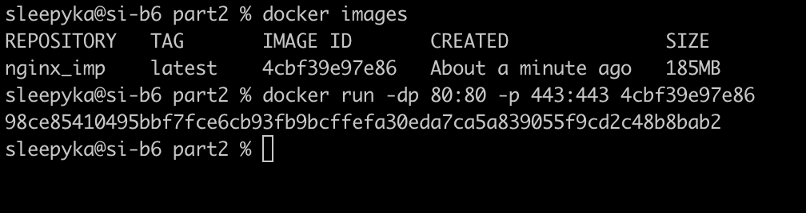
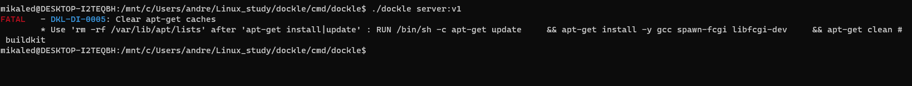

## Part 1. Готовый докер

- Взять официальный докер образ с **nginx** и выкачать его при помощи `docker pull`

- Проверить наличие докер образа через `docker images`

- Запустить докер образ через `docker run -d [image_id|repository]`

- Проверить, что образ запустился через `docker ps`

- Посмотреть информацию о контейнере через `docker inspect [container_id|container_name]`

- По выводу команды определить и поместить в отчёт размер контейнера, список замапленных портов и ip контейнера
  
   
  <i>ip контейнера</i>

  
   
  <i>размер контейнера</i>

  
   
  <i>список замапленных портов</i>

- Остановить докер образ через `docker stop [container_id|container_name]`

- Проверить, что образ остановился через `docker ps`

- Запустить докер с портами 80 и 443 в контейнере, замапленными на такие же порты на локальной машине, через команду *run*

- Проверить, что в браузере по адресу *localhost:80* доступна стартовая страница **nginx**

- Перезапустить докер контейнер через `docker restart [container_id|container_name]`

- Проверить любым способом, что контейнер запустился

## Part 2. Операции с контейнером

Докер образ и контейнер готовы. Теперь можно покопаться в конфигурации **nginx** и отобразить статус страницы.

- Прочитать конфигурационный файл *nginx.conf* внутри докер контейнера через команду *exec*

- Создать на локальной машине файл *nginx.conf*
- Настроить в нем по пути */status* отдачу страницы статуса сервера **nginx**

- Скопировать созданный файл *nginx.conf* внутрь докер образа через команду `docker cp`
- Перезапустить **nginx** внутри докер образа через команду *exec*

- Проверить, что по адресу *localhost:80/status* отдается страничка со статусом сервера **nginx**

- Экспортировать контейнер в файл *container.tar* через команду *export*

- Остановить контейнер

- Удалить образ через `docker rmi [image_id|repository]`, не удаляя перед этим контейнеры

- Удалить остановленный контейнер

- Импортировать контейнер обратно через команду *import*

- Запустить импортированный контейнер

- Проверить, что по адресу *localhost:80/status* отдается страничка со статусом сервера **nginx**

## Part 3. Мини веб-сервер

- Настало время немного оторваться от докера, чтобы подготовиться к последнему этапу. Настало время написать свой сервер.
- Выполняем команды по очереди из comands.thx

## Part 4. Свой докер

- Теперь всё готово. Можно приступать к написанию докер образа для созданного сервера.

- запуск bash sever.sh

- переход по localhost:80

- переход по localhost:80/status

## Part 5. **Dockle**

- После написания образа никогда не будет лишним проверить его на безопасность.

- Выполняем команду и видим ошибки

- Проверяем после правок

## Part 6. Базовый **Docker Compose**

- Вот вы и закончили вашу разминку. А хотя погодите...
- Почему бы не поэкспериментировать с развёртыванием проекта, состоящего сразу из нескольких докер образов?

